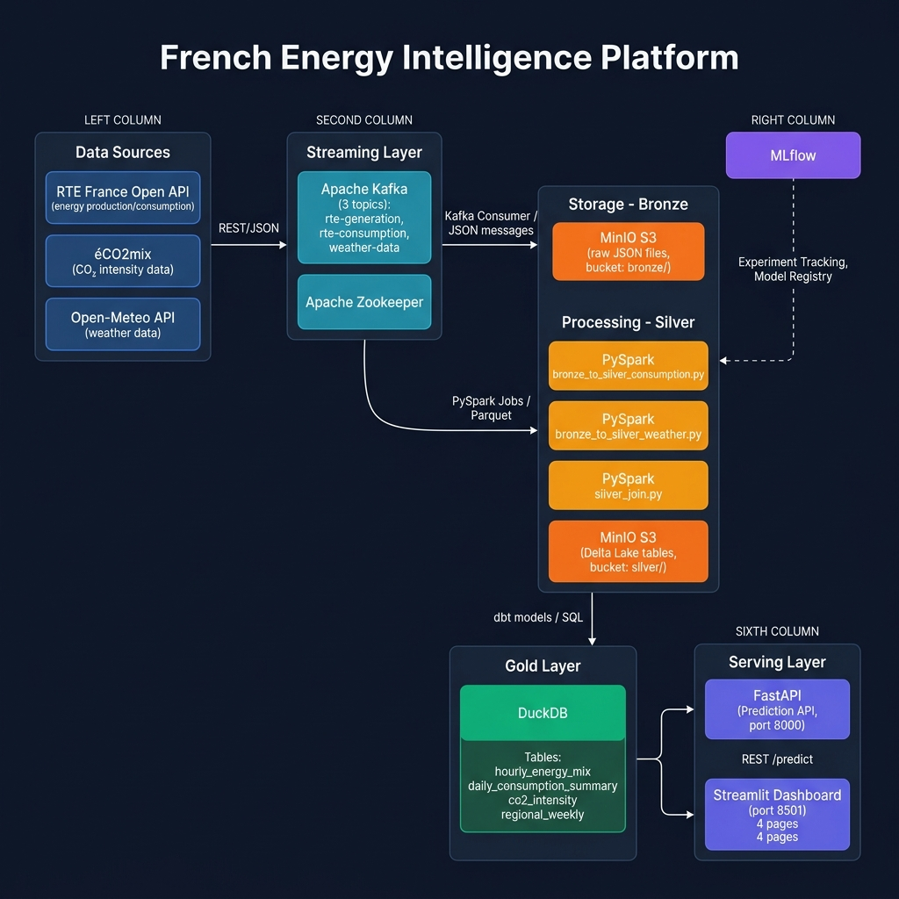
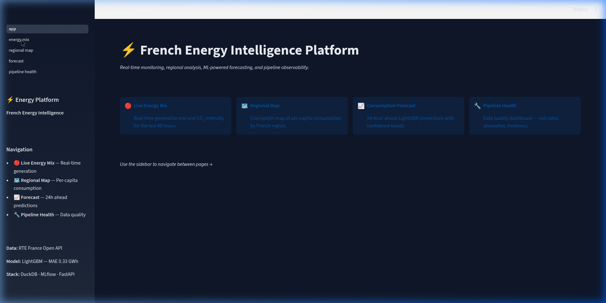
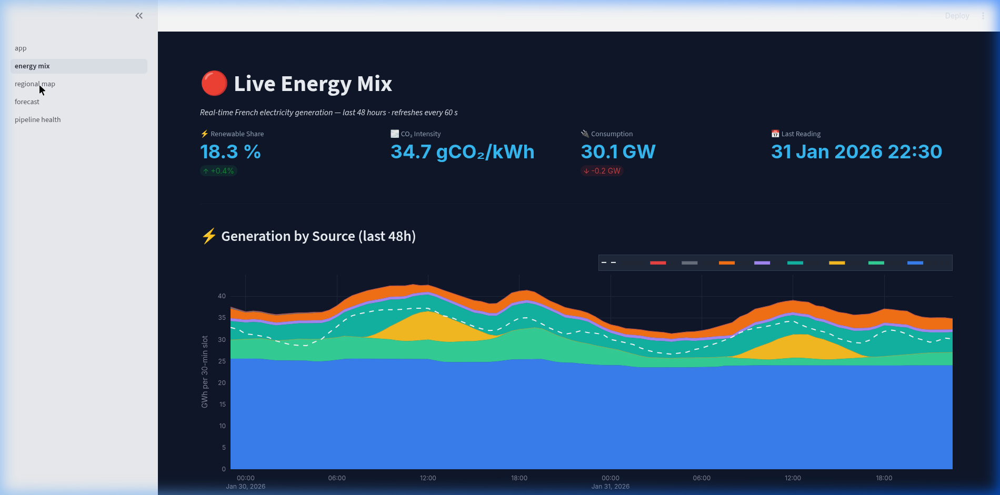
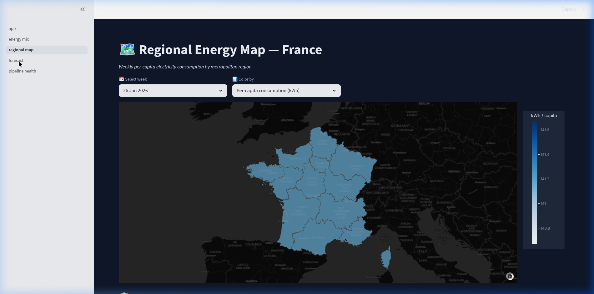
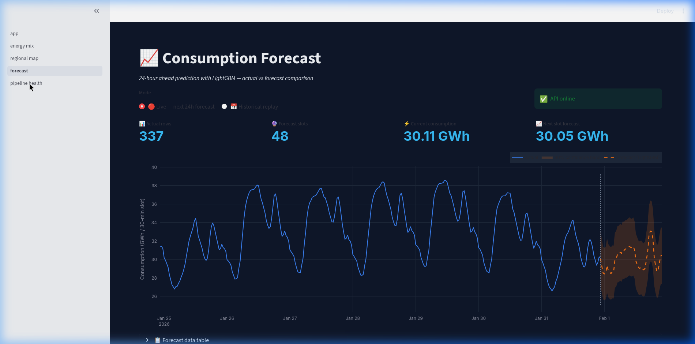

# ⚡ French Energy Intelligence Platform

> End-to-end data engineering platform that streams real-time French electricity data, processes it through a Medallion architecture, serves ML-powered consumption forecasts via REST API, and visualises everything in a 4-page Streamlit dashboard.

[](https://python.org)
[](LICENSE)
[](docker-compose.yml)
[](https://mlflow.org)
[](https://streamlit.io)

---

## 🏗️ Architecture



*Data flows left to right: RTE API → Kafka → MinIO Bronze → PySpark → Delta Lake Silver → dbt → DuckDB Gold → FastAPI + Streamlit*

---

## 🎯 What This Project Does

This platform continuously ingests **real-time electricity data from RTE France** (the French national grid operator) and processes it through a production-grade Medallion pipeline. It tracks **CO₂ intensity** of the French grid in real time, forecasts **30-minute-ahead electricity consumption** using a LightGBM model (MAE = 0.33 GWh, R² = 0.993), and monitors **renewable energy share** across all French regions. The platform demonstrates the full data science lifecycle: streaming ingestion → batch processing → ML training → model registry → prediction API → interactive dashboard.

---

## 🛠️ Tech Stack

| Layer | Tools |
|---|---|
| **Ingestion (Streaming)** | Python 3.11, Apache Kafka, kafka-python-ng, RTE Open API |
| **Storage** | MinIO (S3-compatible), Bronze/Silver/Gold zones |
| **Processing** | Apache Spark 3.5 (PySpark), Delta Lake |
| **Transformation** | dbt-core 1.11, dbt-duckdb |
| **Gold Layer** | DuckDB 1.5 |
| **ML & Tracking** | scikit-learn 1.8, LightGBM 4.6, MLflow 3.11 |
| **Prediction API** | FastAPI 0.136, uvicorn |
| **Dashboard** | Streamlit 1.56, Plotly 6.7 |
| **Infrastructure** | Docker Compose, Zookeeper, Makefile |

---

## 🚀 Quick Start

```bash
# 1. Clone the repository
git clone https://github.com/YOUR_USERNAME/energy.git
cd energy

# 2. Set up environment variables
cp .env.example .env
# → Fill in your RTE API credentials (free at https://data.rte-france.com)

# 3. Start the full stack
make up

# 4. Open the dashboard
open http://localhost:8501
```

> **Note:** `make` must be installed (`sudo apt install make`). All services start via Docker Compose.

| Service | URL |
|---|---|
| 📊 Streamlit Dashboard | http://localhost:8501 |
| 🔮 Prediction API (Swagger) | http://localhost:8000/docs |
| 📈 MLflow UI | http://localhost:5000 |
| 📦 Kafka UI | http://localhost:8080 |
| 🗄️ MinIO Console | http://localhost:9001 |

---

## 📡 Data Sources

| Source | Data | Access |
|---|---|---|
| **RTE France Open API** | Generation, consumption, physical flows (30-min intervals) | [Free registration →](https://data.rte-france.com) |
| **éCO2mix** | CO₂ intensity, renewable share, energy mix | [Download page →](https://www.rte-france.com/eco2mix/les-donnees-de-publication) |
| **Open-Meteo** | Temperature, wind speed (weather for demand forecasting) | [Free API →](https://open-meteo.com) |

---

## 📁 Project Structure

```
energy/
├── Makefile                    # One-command operations
├── docker-compose.yml          # Full stack orchestration
├── requirements.txt            # Pinned Python dependencies
├── .env.example                # Environment variable template
└── src/
    ├── ingestion/              # Kafka producers + bronze consumer
    │   ├── producer_rte.py     # RTE API → Kafka
    │   ├── producer_weather.py # Open-Meteo → Kafka
    │   ├── consumer_bronze.py  # Kafka → MinIO (raw JSON)
    │   ├── backfill_historical.py
    │   └── Dockerfile
    ├── processing/             # PySpark bronze → silver jobs
    │   ├── bronze_to_silver_consumption.py
    │   ├── bronze_to_silver_generation.py
    │   ├── bronze_to_silver_weather.py
    │   └── silver_join.py
    ├── dbt/energy_platform/    # dbt models (silver → gold)
    │   └── models/
    │       ├── staging/        # stg_energy
    │       └── gold/           # hourly_energy_mix, daily_consumption_summary,
    │                           # co2_intensity, regional_weekly
    ├── ml/                     # Machine learning
    │   ├── train_consumption_model.py  # 3 models + MLflow tracking
    │   └── predict.py          # Registry loader + confidence intervals
    ├── api/                    # FastAPI prediction service
    │   ├── main.py             # GET /, GET /health, POST /predict
    │   └── Dockerfile
    ├── dashboard/              # Streamlit 4-page app
    │   ├── app.py              # Main entry point
    │   ├── pages/
    │   │   ├── 01_energy_mix.py      # Live generation stacked chart
    │   │   ├── 02_regional_map.py    # Choropleth map by region
    │   │   ├── 03_forecast.py        # 24h LightGBM forecast
    │   │   └── 04_pipeline_health.py # Data quality monitoring
    │   └── Dockerfile
    ├── data/
    │   └── gold.duckdb         # Gold layer (gitignored, ~9MB)
    ├── docs/
    │   ├── architecture.png    # Architecture diagram
    │   └── dbt_lineage.png     # dbt model lineage graph
    └── explore/                # Exploration & API test scripts
```

---

## 📸 Dashboard Screenshots

| Live Energy Mix | Regional Map |
|---|---|
|  |  |

| Consumption Forecast | Pipeline Health |
|---|---|
|  |  |

---

## 🤖 ML Model Results

Three models trained and tracked in MLflow on 3 years of 30-minute data (53,747 rows):

| Model | MAE (GWh) | RMSE | R² | vs Naive |
|---|---|---|---|---|
| Linear Regression | 0.9441 | 1.1933 | 0.9557 | +23% |
| Random Forest | 0.4173 | 0.6124 | 0.9883 | +66% |
| **LightGBM 🏆** | **0.3334** | **0.4840** | **0.9927** | **+73%** |

- **Champion model**: LightGBM v1 — registered in MLflow as `energy-forecast-prod/Production`
- **Relative error**: 1.3% on a ~25.6 GWh/slot national grid
- **Key features**: `consumption_lag_1h`, `consumption_lag_24h`, `consumption_lag_168h` (temporal autocorrelation dominates)

---

## ⚠️ Known Limitations & Future Work

| Limitation | Future improvement |
|---|---|
| Weather data not joined in ML features (all null) | Run `silver_join.py` once Kafka weather stream is live |
| No automated retraining schedule | Airflow DAG to retrain weekly on new data |
| Single-node Spark (no cluster) | Migrate to Databricks or AWS EMR for scale |
| DuckDB as gold layer | Migrate to Snowflake or BigQuery for multi-user access |
| No alerting on anomalies | PagerDuty / Slack alerts via MLflow callbacks |
| Manual model registration | CI/CD pipeline with auto-promotion on MAE threshold |

---

## 🔧 Makefile Reference

```bash
make up          # Start full stack (detached)
make down        # Stop all containers
make build       # Rebuild images and start
make logs        # Follow all service logs
make spark-run   # Run PySpark bronze → silver jobs
make dbt-run     # Run dbt silver → gold models
make train       # Re-train ML models (MLflow must be running)
make test        # Data quality checks on gold layer
make clean       # Full teardown including volumes
```

---

## 📄 License

MIT — free to use, fork, and build on.

---

---

## 🇫🇷 Résumé en français

Ce projet est une plateforme de données end-to-end pour analyser et prévoir la consommation électrique française en temps réel. Il ingère les données ouvertes de RTE (Réseau de Transport d'Électricité) via une API REST, les diffuse dans Apache Kafka, puis les transforme en couches Bronze, Silver et Gold à l'aide de PySpark et dbt. Un modèle LightGBM, suivi avec MLflow, prédit la consommation 30 minutes à l'avance avec une erreur moyenne de 0,33 GWh et un R² de 0,993. Les résultats sont exposés via une API FastAPI et visualisés dans un tableau de bord Streamlit interactif avec une carte choroplèthe des régions françaises, un graphique de mix énergétique en temps réel, et un moniteur de qualité des données.

*Ce projet a été construit pour démontrer une maîtrise complète de la stack data moderne : Kafka, Spark, Delta Lake, dbt, DuckDB, MLflow, FastAPI et Streamlit — des outils utilisés par BNP Paribas, Société Générale, EDF et les principales entreprises françaises de la tech.*
